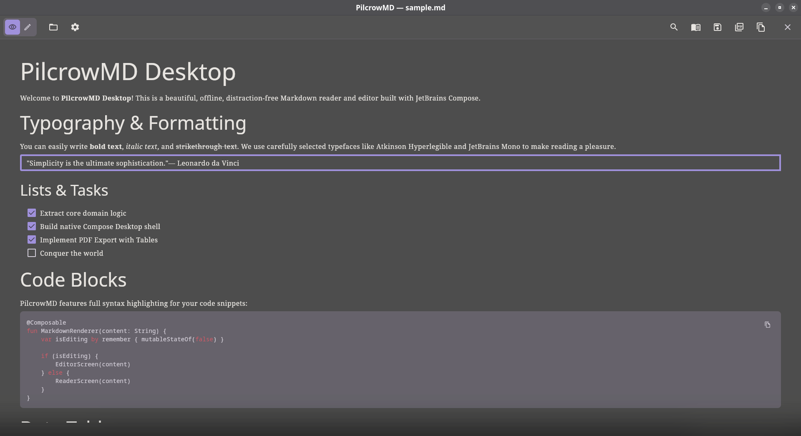
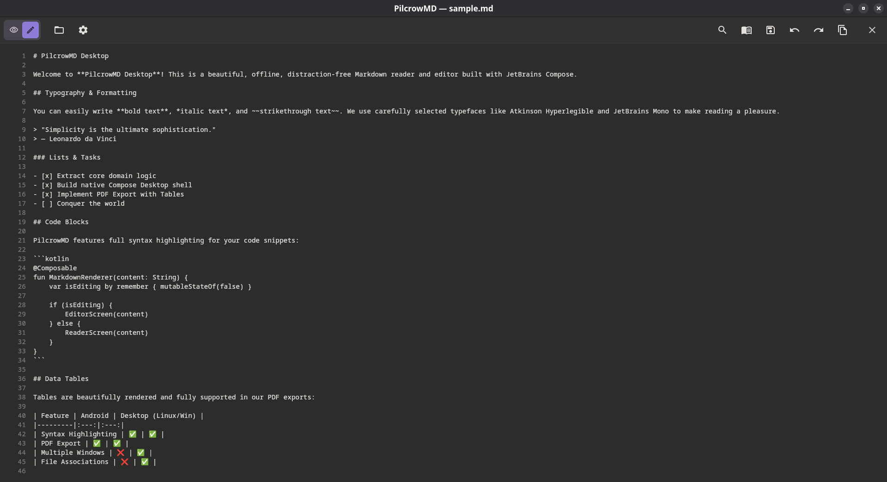

# PilcrowMD Desktop

**PilcrowMD Desktop** is a beautiful, offline, distraction-free Markdown reader and editor for Windows, macOS, and Linux. 

This project is a complete native desktop port of the original [PilcrowMD Android app](https://github.com/pilcrowmd/pilcrow), built using **JetBrains Compose Desktop**. It brings the elegant, dual-pane Markdown experience from mobile directly to your computer.

## ✨ Features

- **Cross-Platform Native Apps:** Runs cleanly as an `.msi` on Windows, `.dmg` on macOS, and `.rpm`/`.deb`/`.AppImage` on Linux.
- **Split Reader & Editor Modes:** Seamlessly switch between writing raw Markdown and reading beautifully typeset documents.
- **Syntax Highlighting & Formatting:** Full support for standard Markdown, code blocks, tables, and strikethroughs.
- **In-document Search:** Fast search with match highlighting and auto-scrolling to results.
- **PDF Export:** Export your Markdown directly to a paginated, print-styled PDF (with full support for tables and code blocks).
- **Customizable Typography:** Independent font scaling for both the reader and editor, with built-in font families.
- **Dark & Light Themes:** Toggle instantly between a default dark theme and a warm-cream light theme.
- **Native OS Integration:** Registers as the default handler for `.md` files in your operating system.

## 📸 Screenshots

<div align="center">

| Reader Mode | Editor Mode |
|:---:|:---:|
|  |  |

</div>

## 🚀 Download & Install

The easiest way to install PilcrowMD Desktop is to download the installer for your operating system from the **[Releases](https://github.com/abuhamza-git/pilcrow-desktop/releases)** page.

- **Windows:** Download the `.msi` installer.
- **macOS:** Download the `.dmg` installer.
- **Linux:** Download the `.deb` (Debian/Ubuntu), `.rpm` (Fedora/RedHat), or use the portable `.AppImage`.

*(Note: The GitHub Actions workflow automatically builds these installers on every release!)*

## 🛠️ Tech Stack & Architecture

PilcrowMD Desktop was built by extracting the pure-Kotlin domain logic from the original Android app into a shared `core` module, and building a brand new desktop UI shell around it.

| Area | Choice |
|---|---|
| Language | Kotlin 2.3 |
| UI Framework | JetBrains Compose Desktop |
| Markdown Parsing | `commonmark-java` (with GFM extensions) |
| PDF Generation | `openhtmltopdf` |
| State Management | Coroutines & Flow |
| Persistence | JSON-backed StorageManager (`~/.config/pilcrow/`) |
| Build Tool | Gradle (Kotlin DSL) |

## 🏗️ Build it yourself

Requirements: JDK 17+

```bash
git clone https://github.com/abuhamza-git/pilcrow-desktop.git
cd pilcrow-desktop

# Run the app locally for testing
./gradlew :desktop-app:run

# Package native distributions (deb, rpm, appimage) on Linux
./gradlew :desktop-app:packageDistributionForCurrentOS
```

## 📜 License

Like the original Android app, PilcrowMD Desktop is licensed under the **GNU General Public License v3.0 or later (GPL-3.0-or-later)**. Copyright © 2026.

The app bundles third-party dependencies and fonts which are documented under `LICENSES.md` and surfaced in-app.
