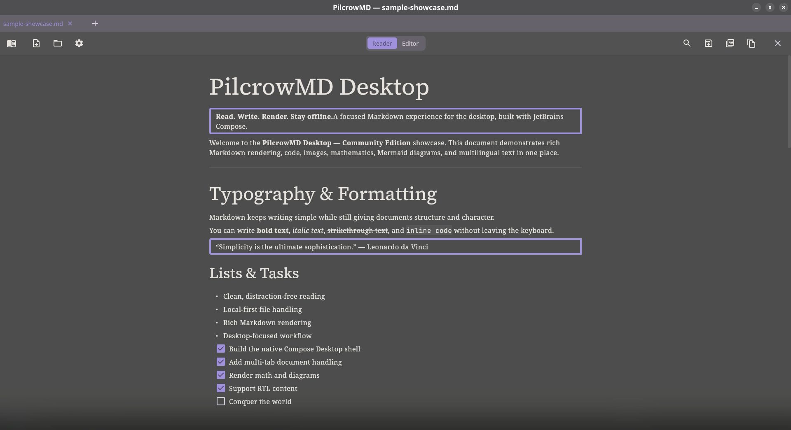
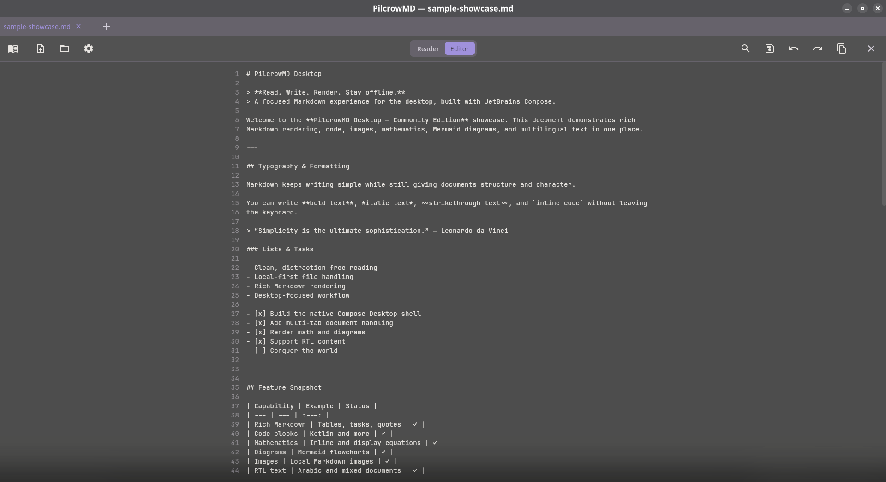
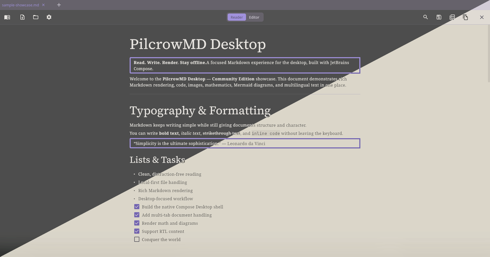
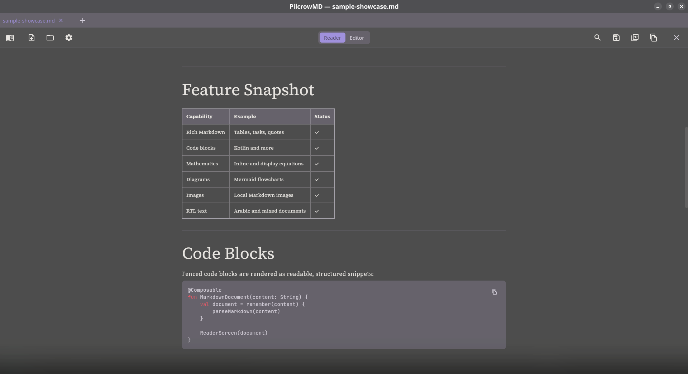
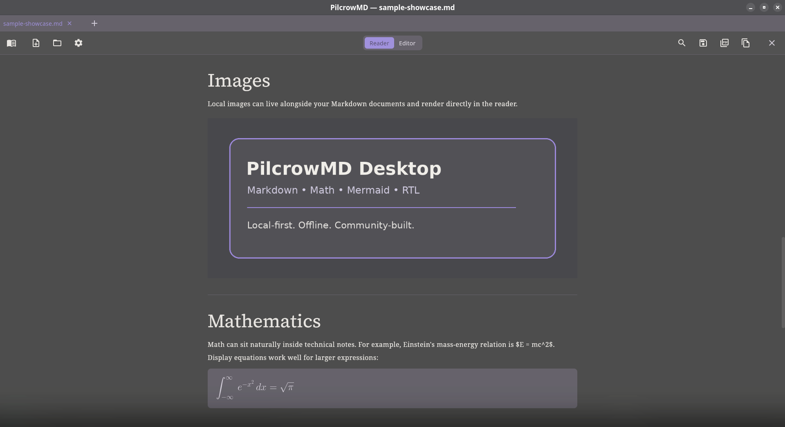
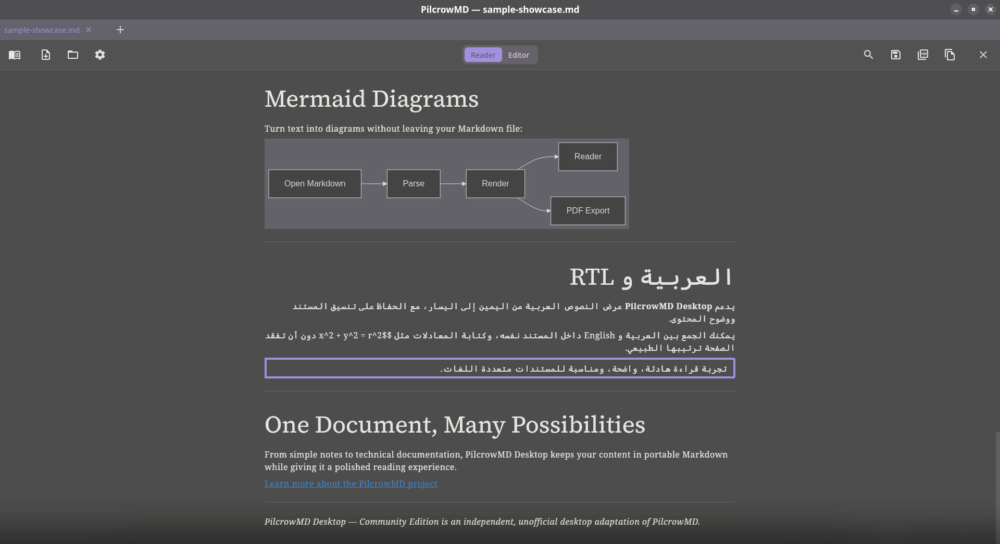

# PilcrowMD Desktop — Community Edition

A beautiful, distraction-free Markdown reader and editor for Linux and Windows.

> **Community project**
>
> This is an independent, unofficial desktop adaptation of PilcrowMD. It is not an official release of, affiliated with, sponsored by, or endorsed by the original PilcrowMD project or its developer.

<div align="center">
  
</div>

## Highlights

- **Reader & Editor Modes** — Seamlessly toggle between raw Markdown editing and rich visual rendering.
- **Rich Markdown Rendering** — Full support for GFM-style tables, task lists, blockquotes, and fenced code blocks.
- **Syntax Highlighting** — Beautiful code block highlighting in Reader mode.
- **Arabic & RTL Support** — Native block-level Right-to-Left (RTL) support for mixed-language documents, complete with bundled Amiri fonts.
- **Math & Diagrams** — Render JLaTeXMath equations and Mermaid diagrams directly in your documents.
- **PDF Export** — High-fidelity PDF generation with RTL-aware text handling.
- **Desktop Workflow** — Multi-tab interface with native Linux/Windows file dialogs.
- **Local-First & Private** — All Markdown processing stays entirely offline on your computer.

## Desktop Experience

<table>
  <tr>
    <td width="50%" align="center"><strong>Editor</strong></td>
    <td width="50%" align="center"><strong>Light & Dark Themes</strong></td>
  </tr>
  <tr>
    <td></td>
    <td></td>
  </tr>
</table>

PilcrowMD Desktop embraces a native desktop workflow featuring multi-tab document management, custom keyboard shortcuts, and native OS file selection dialogs. 

*(Note: The current desktop editor uses a Compose basic text field and does not yet include the advanced real-time syntax highlighting provided by the Sora Editor on the upstream Android app).*

## Rich Markdown Rendering

<table>
  <tr>
    <td width="50%" align="center"><strong>Tables & Code</strong></td>
    <td width="50%" align="center"><strong>Images & Math</strong></td>
  </tr>
  <tr>
    <td></td>
    <td></td>
  </tr>
</table>

Leveraging the `commonmark-java` parser, documents are rendered directly into native Compose UI elements. 

### Mermaid & RTL

<div align="center">
  
</div>

PilcrowMD Desktop brings first-class support for Right-to-Left (RTL) languages like Arabic and Persian. By parsing the AST at the block level, the application dynamically aligns Arabic paragraphs to the right while leaving English content anchored to the left. The bundled Amiri font ensures that all Arabic text—both in the application and in exported PDFs—is flawlessly shaped and readable. 

## Download

[Download the latest release](https://github.com/abuhamza-git/pilcrow-desktop/releases/latest)

Pre-compiled packages are available for:
- **Windows:** `.msi`, `.exe`
- **Linux:** `.deb`, `.rpm`

## Build from Source

Ensure you have **JDK 17** installed.

To run the application locally:
```bash
./gradlew :desktop-app:run
```

To run the test suite:
```bash
./gradlew test
```

To build distribution packages (e.g., Linux RPM):
```bash
./gradlew :desktop-app:packageRpm
```

## Architecture

The project has been refactored from a monolithic mobile app into a modular structure:

- **`:core`** — Platform-independent Kotlin domain logic, shared models, and states.
- **`:desktop-app`** — The JetBrains Compose Desktop implementation, including window management, native file I/O, and UI rendering.
- **`:app`** — The original Android source code (retained in the repository for reference, but currently disabled in the Gradle build).

## Tech Stack

| Component | Technology |
|---|---|
| **Language** | Kotlin & Java 17 |
| **UI Framework** | JetBrains Compose Desktop |
| **Markdown Parser** | `commonmark-java` (with GFM extensions) |
| **PDF Engine** | `OpenHTMLtoPDF` (with ICU4J Bidi support) |
| **Math Rendering** | `JLaTeXMath` |
| **Build System** | Gradle Kotlin DSL |

## Community Edition vs. Upstream

| Area | Original PilcrowMD | Desktop Community Edition |
|------|--------------------|---------------------------|
| **Platform** | Android | Linux & Windows |
| **UI Framework** | Jetpack Compose | JetBrains Compose Desktop |
| **Editor** | Sora Editor (Advanced highlighting) | Compose BasicTextField (Plain text) |
| **File Access** | Android Storage Access Framework | Native Desktop `java.io.File` / Zenity / Kdialog |
| **RTL Handling** | Standard Android views | Custom block-level AST logic + ICU4J Bidi |
| **Desktop Integration** | N/A | Multi-tab UI, native OS file dialogs |

## Current Limitations

- The desktop editor does not currently feature the advanced real-time syntax highlighting of the upstream Sora Editor.
- macOS is not a supported release target.
- PDF exporter strictly relies on the bundled Amiri font for Arabic characters.

## Original PilcrowMD / Acknowledgements

This Community Edition is an independent port made possible by the incredible groundwork of the original PilcrowMD project. 

🔗 **Upstream Repository:** [https://github.com/pilcrowmd/pilcrow](https://github.com/pilcrowmd/pilcrow)

All upstream code, architecture, and design paradigms remain credited to their original authors and contributors.

## Contributing

We welcome contributions from the community! Feel free to open issues, submit bug reports, suggest new features, or open pull requests. For detailed guidelines, please review our [CONTRIBUTING.md](CONTRIBUTING.md).

## License

PilcrowMD Desktop — Community Edition is based on the GPL-licensed
[PilcrowMD](https://github.com/pilcrowmd/pilcrow) project and is distributed
under the **GNU General Public License v3.0 or later (GPL-3.0-or-later)**.

See [LICENSE](LICENSE) for the full license text.

For third-party library and asset attributions, see [LICENSES.md](LICENSES.md).

Copyright in code originating from the upstream PilcrowMD project remains
with its respective copyright holders.

---

> **Affiliation Notice:** PilcrowMD Desktop — Community Edition is an independently maintained repository and is not an official PilcrowMD release.
