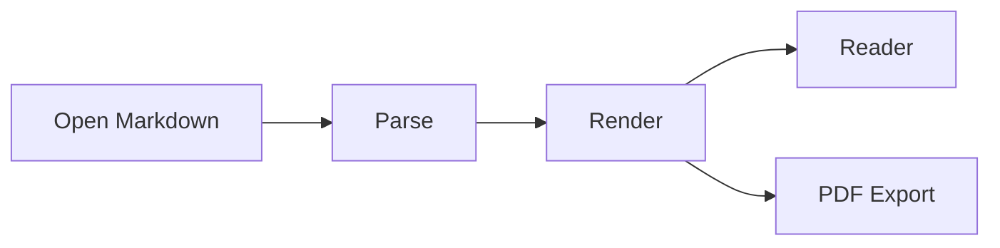

# PilcrowMD Desktop

> **Read. Write. Render. Stay offline.**  
> A focused Markdown experience for the desktop, built with JetBrains Compose.

Welcome to the **PilcrowMD Desktop — Community Edition** showcase. This document demonstrates rich Markdown rendering, code, images, mathematics, Mermaid diagrams, and multilingual text in one place.

---

## Typography & Formatting

Markdown keeps writing simple while still giving documents structure and character.

You can write **bold text**, *italic text*, ~~strikethrough text~~, and `inline code` without leaving the keyboard.

> “Simplicity is the ultimate sophistication.” — Leonardo da Vinci

### Lists & Tasks

- Clean, distraction-free reading
- Local-first file handling
- Rich Markdown rendering
- Desktop-focused workflow

- [x] Build the native Compose Desktop shell
- [x] Add multi-tab document handling
- [x] Render math and diagrams
- [x] Support RTL content
- [ ] Conquer the world

---

## Feature Snapshot

| Capability | Example | Status |
| --- | --- | :---: |
| Rich Markdown | Tables, tasks, quotes | ✓ |
| Code blocks | Kotlin and more | ✓ |
| Mathematics | Inline and display equations | ✓ |
| Diagrams | Mermaid flowcharts | ✓ |
| Images | Local Markdown images | ✓ |
| RTL text | Arabic and mixed documents | ✓ |

---

## Code Blocks

Fenced code blocks are rendered as readable, structured snippets:

```kotlin
@Composable
fun MarkdownDocument(content: String) {
    val document = remember(content) {
        parseMarkdown(content)
    }

    ReaderScreen(document)
}
```

---

## Images

Local images can live alongside your Markdown documents and render directly in the reader.


---

## Mathematics

Math can sit naturally inside technical notes. For example, Einstein's mass-energy relation is $E = mc^2$.

Display equations work well for larger expressions:

$$
\int_{-\infty}^{\infty} e^{-x^2}\,dx = \sqrt{\pi}
$$

And a familiar identity:

$$
a^2 + b^2 = c^2
$$

---

## Mermaid Diagrams

Turn text into diagrams without leaving your Markdown file:



---

## العربية و RTL

يدعم **PilcrowMD Desktop** عرض النصوص العربية من اليمين إلى اليسار، مع الحفاظ على تنسيق المستند ووضوح المحتوى.

يمكنك الجمع بين العربية و English داخل المستند نفسه، وكتابة المعادلات مثل $x^2 + y^2 = r^2$ دون أن تفقد الصفحة ترتيبها الطبيعي.

> تجربة قراءة هادئة، واضحة، ومناسبة للمستندات متعددة اللغات.

---

## One Document, Many Possibilities

From simple notes to technical documentation, PilcrowMD Desktop keeps your content in portable Markdown while giving it a polished reading experience.

[Learn more about the PilcrowMD project](https://github.com/pilcrowmd/pilcrow)

---

*PilcrowMD Desktop — Community Edition is an independent, unofficial desktop adaptation of PilcrowMD.*
