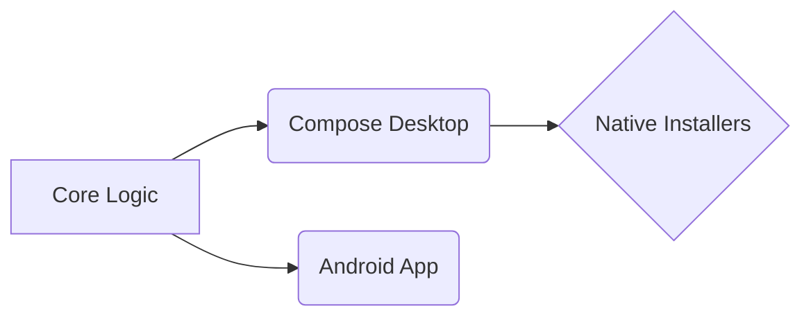

# PilcrowMD Desktop

Welcome to **PilcrowMD Desktop**! This is a beautiful, offline, distraction-free Markdown reader and editor built with JetBrains Compose.

## Typography & Formatting

You can easily write **bold text**, *italic text*, and ~~strikethrough text~~. We use carefully selected typefaces like Atkinson Hyperlegible and JetBrains Mono to make reading a pleasure.

> "Simplicity is the ultimate sophistication." 
> — Leonardo da Vinci

### Lists & Tasks

- [x] Extract core domain logic
- [x] Build native Compose Desktop shell
- [x] Implement PDF Export with Tables
- [ ] Conquer the world

## Code Blocks

PilcrowMD features full syntax highlighting for your code snippets:

```kotlin
@Composable
fun MarkdownRenderer(content: String) {
    var isEditing by remember { mutableStateOf(false) }
    
    if (isEditing) {
        EditorScreen(content)
    } else {
        ReaderScreen(content)
    }
}
```

## Data Tables

Tables are beautifully rendered and fully supported in our PDF exports:

| Feature | Android | Desktop (Linux/Win) |
|---------|:---:|:---:|
| Syntax Highlighting | ✅ | ✅ |
| PDF Export | ✅ | ✅ |
| Multiple Windows | ❌ | ✅ |
| File Associations | ❌ | ✅ |

## Mathematics & Diagrams

Render complex equations using LaTeX:
$$ E = mc^2 $$

Or design architecture flows using Mermaid:

